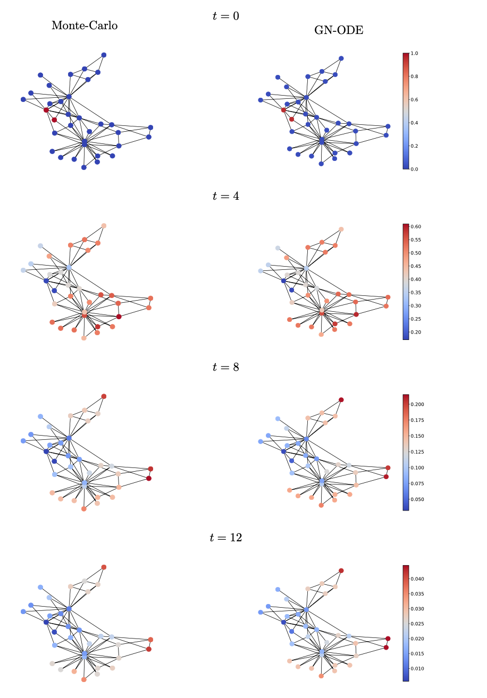

# Neural Ordinary Differential Equations for Modeling Epidemic Spreading (GN-ODE)
## Predicting SIR model on Large Complex Networks



<sub>Visualization of the evolution of infection over time on the karate dataset. Given the initially infected nodes (with red at t = 0), we compare the predictions (probability that a node is in state I) of the proposed GN-ODE model (right) against the ground truth probabilities obtained through Monte-Carlo simulations (left).</sub>

Network Datasets are in the ```real_graphs``` folder.

SIR labels for $t \in [0,...T]$ are extracted using Monte-Carlo simulations on the undirected/unweighted preprocessed graphs.

For single graph training: `python monitorer-sim.py`  
Inside the script you need to specify the following:
- `datasets_array` can be equal to `['./real_graphs/epinions']` or based on the desired dataset path in folder `real_graphs`.
- `model` can be equal to `dmp` (Dynamic Message Passing), `GCN`, `GIN` (GNN variants), `ode_nn` (the proposed GN-ODE).
- the hyperparameters for training: `epochs`, `lr`, `batch_size`, and the `hidden_dim_array` (e.g. [64] for hidden_size 64).
- the hyperparameters for Monte-carlo simulations and labels extraction: `beta`, `gamma` (infection and recovery rates), `deltaT` (step size of teh ODE solver), `maxTime` (number of spreading time steps), `sim` (number of Monte-carlo simulations).

For multiple graph training and inference on a bigger unseen graph: `python monitorer-ngraphs.py`  
Inside the script you need to specify the following:
- `datasets_array` can be equal to `['./real_graphs/dolphins+fb-food+fb-social+openflights+wiki-vote+epinions']` for training on dolphins, fb-food, fb-social, openflights, wiki-vote and predictions on epinions.
- rest parameters can be selected as descrived above for `python monitorer-sim.py`.
